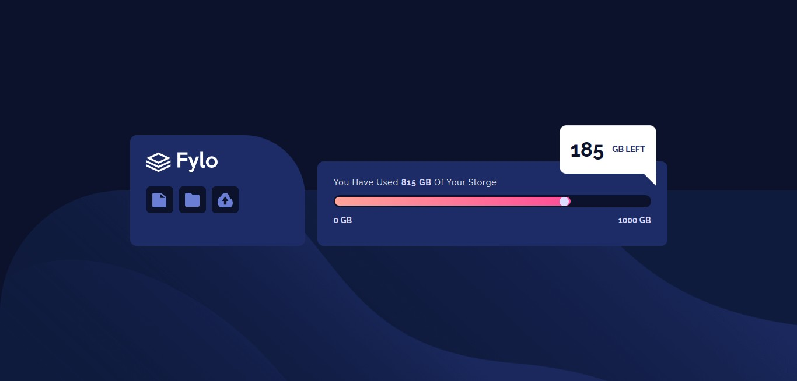

# Frontend Mentor - Fylo data storage component solution

This is a solution to the [Fylo data storage component challenge on Frontend Mentor](https://www.frontendmentor.io/challenges/fylo-data-storage-component-1dZPRbV5n/hub). Frontend Mentor challenges help you improve your coding skills by building realistic projects.

## Table of contents

- [Overview](#overview)
  - [The challenge](#the-challenge)
  - [Screenshot](#screenshot)
  - [Links](#links)
- [My process](#my-process)
  - [Built with](#built-with)
- [Author](#author)

## Overview

### The challenge

Users should be able to:

- View the optimal layout depending on their device's screen size

### Screenshot

### Links

- Solution URL: [frontend mentor](https://www.frontendmentor.io/solutions/css-flexbox-Gxea07gKh)
- Live Site URL: (https://abdallarahmah.github.io/Fylo-data-storage-component/)

## My process

### Built with

- Semantic HTML5 markup
- CSS custom properties
- Flexbox
- Mobile-first workflow

## Author

- linkedIn - [Abdalla-Rahmah](https://www.linkedin.com/in/abdalla-rahmah/)
- Frontend Mentor - [@AbdallaRahmah](https://www.frontendmentor.io/profile/AbdallaRahmah)
- Twitter - [@Abdalla_Rahmah](https://twitter.com/abdalla_Rahmah)
